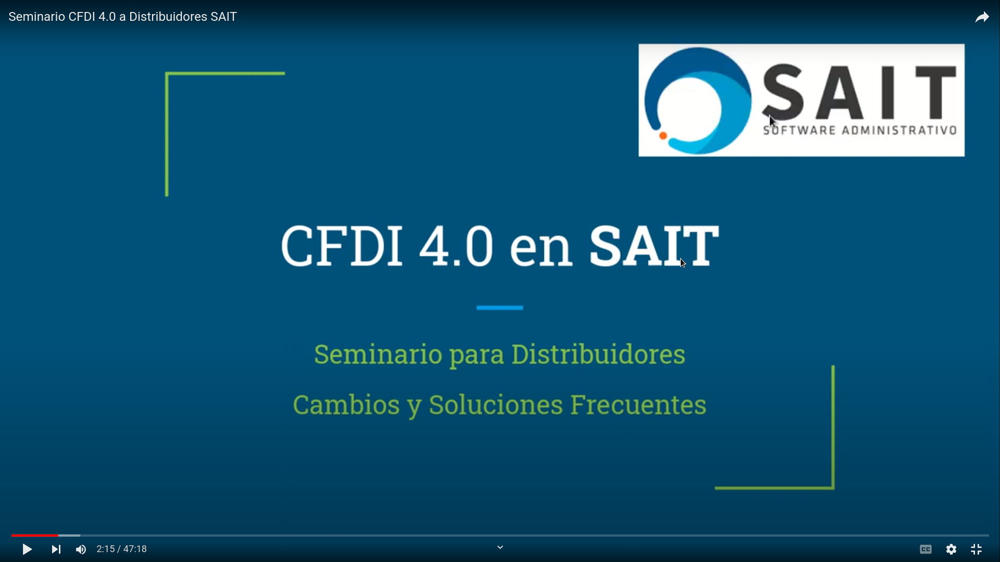

# CFDI 4.0 en SAIT Software GitHub

#### 1. Hacer Respaldo de la Empresa

- Entrar a la empresa en SAIT
- Ir a Utilerias - Respaldar Información
- Asegurarse se generó el archivo ZIP
- Otra forma de respaldar es Copiar la carpeta de la empresa

#### 2. Instalar la APP para Actualizar

- Entrar al navegador
- Descargar el archivo https://www.sait.mx/download/ACTSAIT.ZIP
- Ir a tu folder de Descargas C:\Users\Manuel\Downloads
- Descomprimir el archivo descargado
- Encontraras el archivo actsait.app
- Copiar C:\Users\Manuel\Downloads\actsait.app en el folder de la empresa 

#### 3. Actualizar SAIT usando la App Actualizadora

- Entrar a SAIT
- Ir a Ayuda - Actualizar Sistema SAIT
- Confirmar
- Se descargará e instalará la nueva versión
- Al entrar la nueva versión te va a pedir actualizar las tablas
- Proceder con confianza.
- Revisar los nuevos cambios de la versión
- Salir de SAIT 
- Ir a C:\Users\Manuel\Documents\SAIT y revisar:
    - Se haya renombrado la versión anterior
    - Se haya descargado la nueva versión

